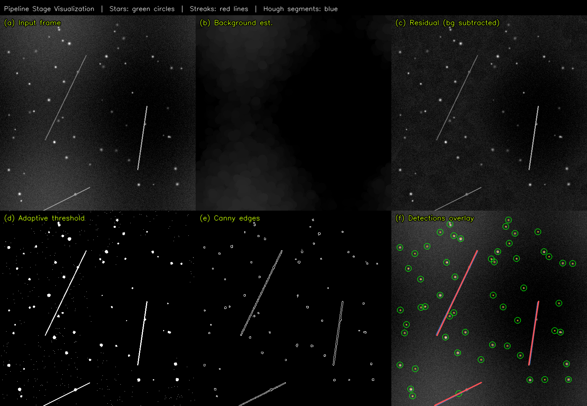
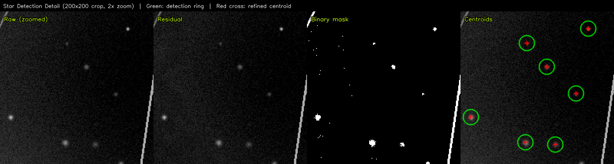
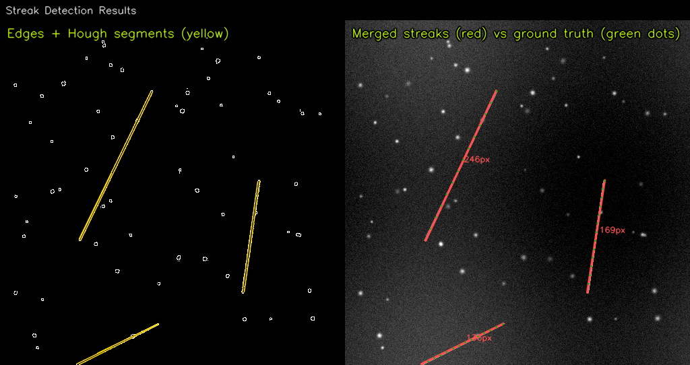
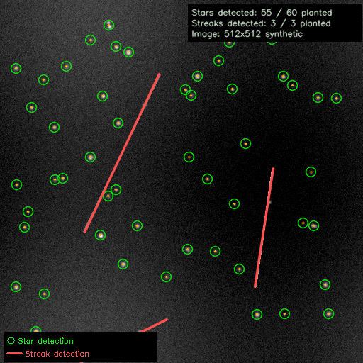

# Space Sensing Image Processing Pipeline

A high-performance image processing and detection pipeline for space surveillance imagery, implementing star (point-source) detection and linear streak (satellite/debris trail) detection. The core algorithms are implemented in optimized C++ with OpenCV, translated from validated Python prototypes.

This project was developed as part of work related to the **Strategic Space Sensing Lab** in Aerospace Engineering, focusing on translating research-grade detection algorithms into efficient, production-ready C++ code suitable for real-time processing constraints.

---

## Architecture

```
┌─────────────────────────────────────────────────────────────────────────┐
│                        Input Frame (Grayscale)                         │
│                      (Sensor image or synthetic)                       │
└──────────────────────────────┬──────────────────────────────────────────┘
                               │
                 ┌─────────────▼──────────────┐
                 │   Background Estimation     │
                 │  (Morphological Opening)    │
                 │  image_processing.cpp       │
                 └─────────────┬──────────────┘
                               │
              ┌────────────────┼────────────────┐
              ▼                                  ▼
┌──────────────────────┐             ┌──────────────────────┐
│  STAR DETECTION PATH │             │ STREAK DETECTION PATH│
│  star_detector.cpp   │             │ streak_detector.cpp  │
└──────────┬───────────┘             └──────────┬───────────┘
           │                                     │
           ▼                                     ▼
┌──────────────────────┐             ┌──────────────────────┐
│ Adaptive Threshold   │             │  Bilateral Filter    │
│ (mean + k*sigma of   │             │  (Noise reduction    │
│  noise floor)        │             │   preserving edges)  │
└──────────┬───────────┘             └──────────┬───────────┘
           │                                     │
           ▼                                     ▼
┌──────────────────────┐             ┌──────────────────────┐
│ Connected Component  │             │  Canny Edge          │
│ Labeling + Filtering │             │  Detection           │
│ (area, eccentricity) │             └──────────┬───────────┘
└──────────┬───────────┘                        │
           │                                     ▼
           ▼                         ┌──────────────────────┐
┌──────────────────────┐             │  Probabilistic Hough │
│ Sub-Pixel Centroid   │             │  Line Transform      │
│ Refinement           │             └──────────┬───────────┘
│ (Intensity-weighted  │                        │
│  moments)            │                        ▼
└──────────┬───────────┘             ┌──────────────────────┐
           │                         │  Segment Clustering  │
           │                         │  (Angle + distance   │
           │                         │   merging)           │
           │                         └──────────┬───────────┘
           ▼                                     ▼
┌──────────────────────┐             ┌──────────────────────┐
│  Star Detections     │             │  Streak Detections   │
│  (x, y, area,       │             │  (endpoints, length, │
│   refined centroid)  │             │   fragment count)    │
└──────────────────────┘             └──────────────────────┘
```

### Module Dependency Graph

```
┌──────────────────────────────────────────────────────┐
│                     main.cpp                         │
│           (CLI, synthetic data gen, I/O)             │
└───────┬─────────────────────────────────┬────────────┘
        │                                 │
        ▼                                 ▼
┌───────────────────┐          ┌───────────────────────┐
│  star_detector    │          │   streak_detector     │
│  (.hpp / .cpp)    │          │   (.hpp / .cpp)       │
└────────┬──────────┘          └────────┬──────────────┘
         │                              │
         └──────────┬───────────────────┘
                    ▼
         ┌──────────────────────┐
         │  image_processing    │    ◄── shared background estimation
         │  (.hpp / .cpp)       │        and adaptive thresholding
         └──────────────────────┘
                    ▲
         ┌──────────────────────┐
         │  profiler.hpp        │    ◄── header-only timing utilities
         └──────────────────────┘
```

### Source File Descriptions

| File | Purpose |
|------|---------|
| `include/image_processing.hpp` | Background estimation and adaptive threshold interfaces |
| `include/star_detector.hpp` | Point-source detection structs, configs, and function declarations |
| `include/streak_detector.hpp` | Linear streak detection structs, configs, and function declarations |
| `include/profiler.hpp` | Header-only scoped timer and benchmark statistics collector |
| `src/image_processing.cpp` | Morphological background estimation, noise-adaptive binary thresholding |
| `src/star_detector.cpp` | Connected-component filtering, sub-pixel centroid refinement, synthetic star field generation |
| `src/streak_detector.cpp` | Canny + Hough line detection, co-linear segment clustering, synthetic streak generation |
| `src/main.cpp` | CLI entry point: synthetic test, single-image, and benchmark modes |
| `tests/test_pipeline.cpp` | 11 unit/integration tests covering all pipeline stages |
| `python_prototypes/star_detector.py` | Reference Python implementation of the star detection pipeline |
| `python_prototypes/streak_detector.py` | Reference Python implementation of the streak detection pipeline |
| `scripts/cross_validate.py` | Automated comparison of Python vs C++ detection outputs |

---

## Output Visualizations

The project generates multi-panel diagnostic images showing every pipeline stage and the final detection results. Run `python3 scripts/visualize_pipeline.py` to regenerate these.

### Full Pipeline Stages (2×3 Grid)

Shows the input frame, background estimate, residual, binary threshold, Canny edges, and the final detection overlay side by side:



### Star Detection Detail (Zoomed Crop)

A 200×200 crop at 2× zoom showing raw pixels → residual → binary mask → refined centroid markers:



### Streak Detection Results

Left: Canny edge map with raw Hough segments in yellow. Right: merged streak detections (red) overlaid against ground truth (green dots) with per-streak length annotations:



### Final Composite Output

Combined detection output with stats overlay and legend:



---

## Key Features

- **Python-to-C++ Translation**: Both detection pipelines exist as validated Python prototypes and optimized C++ implementations, demonstrating the full translation workflow
- **Sub-Pixel Centroid Accuracy**: Intensity-weighted moment refinement achieves ~0.1–0.3 px RMS centroid error on well-sampled point spread functions
- **Noise-Adaptive Thresholding**: Automatically adjusts detection sensitivity based on per-frame noise statistics, handling variable exposure/gain
- **Segment Clustering**: Merges fragmented Hough line detections into complete streak tracks using angle and perpendicular distance criteria
- **Performance Profiling**: Built-in scoped timer and multi-run benchmark mode with min/max/mean/stddev statistics for each pipeline stage
- **Cross-Validation**: Automated script verifies C++ output matches the Python reference implementation

---

## Prerequisites

- **C++ Compiler**: GCC 9+ or Clang 10+ with C++17 support
- **CMake**: Version 3.14 or newer
- **OpenCV**: Version 4.x (with `core`, `imgproc`, `imgcodecs` modules)
- **Python 3.8+** (for prototypes and cross-validation): `numpy`, `opencv-python`

### Installing Dependencies

**Ubuntu/Debian:**
```bash
sudo apt-get update
sudo apt-get install build-essential cmake libopencv-dev
pip install numpy opencv-python-headless
```

**macOS (Homebrew):**
```bash
brew install cmake opencv
pip install numpy opencv-python-headless
```

---

## Building

```bash
git clone https://github.com/<your-username>/space-sensing-imgproc.git
cd space-sensing-imgproc
mkdir build && cd build
cmake .. -DCMAKE_BUILD_TYPE=Release
make -j$(nproc)
```

For debug builds with warnings enabled:
```bash
cmake .. -DCMAKE_BUILD_TYPE=Debug
make -j$(nproc)
```

---

## Usage

### Run with Synthetic Test Data (Default)

Generates a 1024×1024 star field with 80 planted stars and 4 streaks, then runs both detectors and reports accuracy and timing:

```bash
./build/space_sensing_pipeline
```

Sample output:
```
[INFO] Generating synthetic 1024x1024 test scene...
[INFO] Planted 80 stars and 4 streaks

=== Star Detection Results ===
Detections found: 81
  Background estimation: 10.03 ms
  Adaptive threshold:    18.27 ms
  Component filtering:   3.74 ms
  Centroid refinement:   0.05 ms
  Total:                 32.08 ms
  Recall: 78/80 (97.5%)

=== Streak Detection Results ===
Raw Hough segments: 11
Merged streaks:     4
  Total:            35.13 ms
```

### Process a Real Image

```bash
./build/space_sensing_pipeline --input path/to/frame.png \
    --output-stars results/stars.png \
    --output-streaks results/streaks.png
```

### Benchmark Mode

Runs N iterations and reports per-stage timing statistics:

```bash
./build/space_sensing_pipeline --benchmark --runs 50
```

### Python Prototypes

```bash
# Star detection
python3 python_prototypes/star_detector.py --synthetic --output-image data/py_stars.png

# Streak detection
python3 python_prototypes/streak_detector.py --synthetic --output-image data/py_streaks.png
```

---

## Testing

### C++ Unit Tests

```bash
cd build
ctest --output-on-failure
# or run directly:
./test_pipeline
```

The test suite includes 11 tests covering:
- Background estimation (feature removal, gradient preservation)
- Adaptive threshold (bright spot detection, noise rejection)
- Star detection (recall on synthetic data, centroid sub-pixel accuracy)
- Streak detection (line finding, co-linear merging, perpendicular separation)
- Profiler utilities (timer accuracy, statistics computation)

### Python ↔ C++ Cross-Validation

After building the C++ code:

```bash
python3 scripts/cross_validate.py
```

This generates a shared test image, runs both implementations, and verifies that the detection counts match within tolerance.

---

## Project Structure

```
space-sensing-imgproc/
├── CMakeLists.txt                     # Build configuration
├── README.md
├── .gitignore
├── include/
│   ├── image_processing.hpp           # Background & threshold interfaces
│   ├── star_detector.hpp              # Star detection API
│   ├── streak_detector.hpp            # Streak detection API
│   └── profiler.hpp                   # Timing utilities (header-only)
├── src/
│   ├── image_processing.cpp           # Shared image processing routines
│   ├── star_detector.cpp              # Star detection implementation
│   ├── streak_detector.cpp            # Streak detection implementation
│   └── main.cpp                       # CLI entry point
├── tests/
│   └── test_pipeline.cpp              # Unit and integration tests
├── python_prototypes/
│   ├── star_detector.py               # Reference star detection prototype
│   └── streak_detector.py             # Reference streak detection prototype
├── scripts/
│   └── cross_validate.py              # Python vs C++ comparison tool
└── data/                              # Test images (generated at runtime)
```

---

## Performance Notes

Measured on a 1024×1024 synthetic frame (single-threaded, compiled with `-O2`):

| Pipeline Stage | Mean Time |
|----------------|-----------|
| Star: Background estimation | ~10 ms |
| Star: Adaptive threshold | ~12 ms |
| Star: Component filtering | ~3 ms |
| Star: Centroid refinement | <0.1 ms |
| **Star: Total** | **~25 ms** |
| Streak: Preprocessing | ~17 ms |
| Streak: Edge detection | ~4 ms |
| Streak: Hough transform | ~3 ms |
| Streak: Clustering | <0.1 ms |
| **Streak: Total** | **~24 ms** |

The morphological opening (background estimation) and the bilateral filter (streak preprocessing) are the two most expensive operations. These are strong candidates for GPU acceleration via CUDA.

---

## Future Work / Extension Points

- **CUDA Acceleration**: Port the morphological opening and bilateral filter to GPU kernels for real-time processing at higher frame rates
- **Multi-Frame Association**: Extend the streak detector to track detections across consecutive frames for orbit determination
- **Embedded Deployment**: Profile and optimize memory allocation patterns for fixed-memory embedded targets
- **FITS Image Support**: Add support for reading astronomical FITS format directly instead of requiring PNG conversion

---

## License

This project is provided for academic and research purposes.
